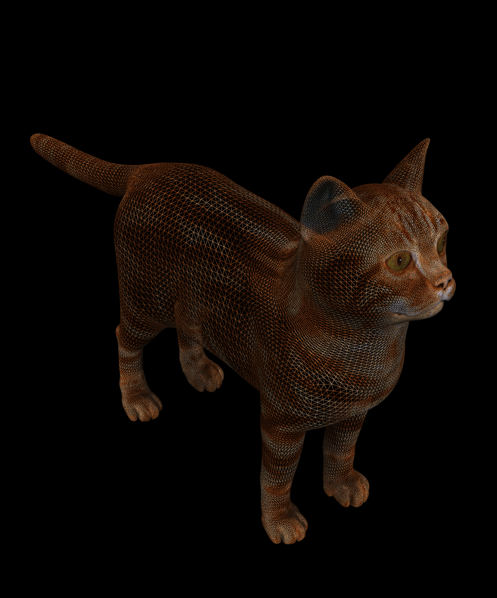
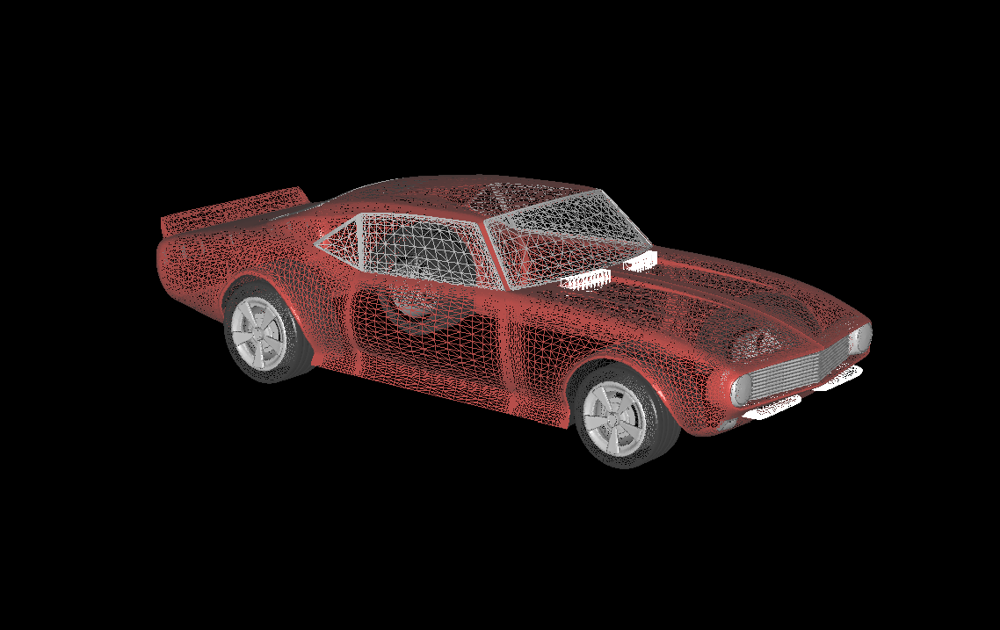
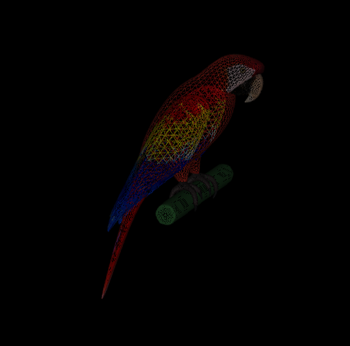

Why this project ?
-
I did this project for an IT intership interview for the **Winnove Medical** company.

A bit of explanation :
-
As you can see on these pictures, the graphical engine is able to handle colors. However, for performance purposes, this function
has been disabled. In addition to that, the models goals is to be 3d printed, so in the end, it will be made of a unique color.





Requirements
-
### Python3 :
* python3 : ```sudo apt-get install python3```

### Librairies : 
* PyOpenGL : ```pip3 install PyOpenGL PyOpenGL_accelerate```
* PyGLM : ```pip3 install PyGLM```
* numpy : ```pip3 install numpy```
* trimesh : ```pip3 install trimesh```
* pywavefront : ```pip3 install --upgrade --user pyglet && pip3 install PyWavefront```
* or : ```pip3 install -r requirement.txt``` 

### Files : 
To be able to open a .obj file, its corresponding .mlt file has to be present is the same directory.
* nameOfTheFile.obj
* nameOfTheFile.mtl


Usage
-
To launch the programm, use `python3 moteur.py nameOfTheFile.obj`. (Example : ```python3 moteur.py test_model/Chevrolet_Camaro_SS_Low.obj```)
A window will appear modeling your 3D model.
You will be able to :
* scroll down to zoom out from the object
* scroll up to zoom in to the object
* turn around the object using your mouse

 
